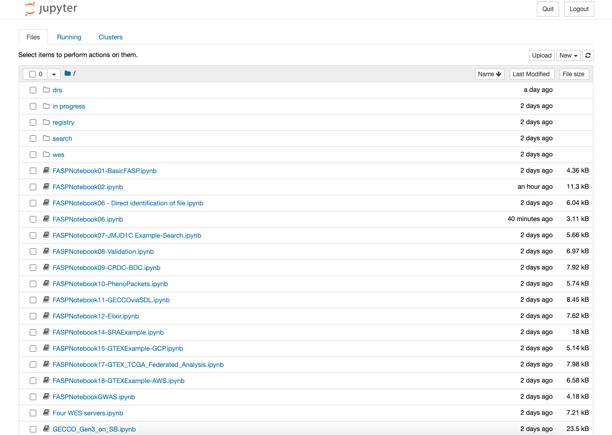

# Getting Started

This guide walks through the step-by-step process of getting FASP newcomers 
prepared to successfully run the scripts within this repo.

## Initial setup

If you already have Python, Pip, and Virtualenv installed on your system, skip
ahead to [Repository setup](#repository-setup).

`fasp-scripts` requires Python version 3.x or higher with `pip` and `virtualenv`
to be installed on your system. Download Python and Pip from the
[downloads page](https://www.python.org/downloads/) and install. Confirm
installation by running:
```
python3 -V
pip3 -V
```

With Python and Pip installed, install virtualenv:
```
python3 -m pip install virtualenv
```

Next, let's setup the `fasp-scripts` repository

## Repository setup <a id="repository-setup"></a>

To begin, clone the `fasp-scripts` repository, and navigate to it.
```
git clone https://github.com/ga4gh/fasp-scripts.git
cd fasp-scripts
```

<a id="virtualenv"></a>
Let's create and activate a virtual environment for `fasp-scripts` to avoid dependency conflicts with other projects.
```
virtualenv env
source env/bin/activate
```

Next, install dependencies and the core library:
```
python setup.py install
pip install .
```

## Create the FASP Settings file

The FASP settings file contains a number of configuration parameters for the 
scripts. Let's copy the [default FASP settings file](./fasp/examples/FASPSettings.json) to another directory, for example, our home directory:
```
cp ./fasp/examples/FASPSettings.json ~
```

Next, let's set the `FASP_SETTINGS` environment variable so the `fasp-scripts`
know where the setting files is located:
```
export FASP_SETTINGS="${HOME}/FASPSettings.json"
```

**NOTE**: consider putting the above command into a terminal startup file, like `.bashrc` or `.bash_profile`, so that `FASP_SETTINGS` is automatically set when starting the command line.

We created our own FASP settings file outside the repository so we can modify
the behavior of certain scripts by changing the parameters. In most cases, the default parameters are enough to get started, however the value of `PipelineLog`
must point to a real directory. Let's create a new directory to store our
Pipeline log file.

```
mkdir -p ~/.fasp-scripts/logs
```

Next, let's modify the value of `PipelineLog` in `FASPSettings.json` to
`${HOME}/.fasp-scripts/logs/pipelineLog.txt` (using the real home directory value
for ${HOME})

## Google Cloud SDK setup

If you have already installed the Google Cloud SDK on your system, and have logged in and set a default project via the SDK, skip ahead to the [Establishing accounts](#establish-accounts) step.

Some scripts involve connecting directly to instances of Google Cloud services,including BigQuery and Storage. To do this, we will need to setup the Google Cloud SDK, and configure our Google profile on the command line. First, download and install the SDK for your system following the [instructions provided by Google](https://cloud.google.com/sdk/docs/install). Confirm installation of the SDK
by running
```
gcloud
```

Next, let's configure the SDK with our credentials and other settings that
need to be accessed at `fasp-script` runtime. First, let's authorize the SDK
to our preferred Google Account for this project. Each of the following commands
will start an OAuth flow, asking us to select the Google Account to be used by
the SDK. Issue each command, selecting the same account.

```
gcloud auth login
gcloud auth application-default login
```

Next, we need to associate a project with the services accessed during `fasp-scripts`. This can be done by creating a new project called `fasp-scripts`
and setting it as the default.

```
gcloud projects create fasp-scripts
gcloud config set project fasp-scripts
```

## Establish accounts with external services, and manage API keys <a id="establish-accounts"></a>

The scripts require the user, acting as a researcher, to have API access
to web services owned by a number of real-world, genomic data sharing institutes.
These institutions include:
* DNAstack
* BioDataCatalyst
* Cancer Research Data Commons (CRDC)
* AnVIL
* Seven Bridges Cancer Genomics Cloud (CGC) 
* Seven Bridges Cavatica

**NOTE**: Remember that the `fasp-scripts` sometimes involve making resource-intensive requests, such as large search queries or compute, to production web services. You may incur a charge to your account from requests made while running the scripts.

Before we register or get our API keys with any of the above platforms, let's 
set up our local directory to hold these keys in the place that the
`fasp-scripts` expect to find them. To do this, simply create the `.keys` folder under your home directory:
```
mkdir ~/.keys
```
OR
```
mkdir $HOME/.keys
```

We will place our API key files under this directory. Now, we need to register
accounts with the data platforms. Let's start with BioDataCatalyst.

### Register with DNAstack

### Register with BioDataCatalyst

### Register with the Cancer Research Data Commons (CRDC)

### Register with AnVIL

### Register with Seven Bridges Cancer Genomics Cloud (CGC)

### Register with Seven Bridges Cavatica

## Running Jupyter Notebooks

### Jupyter Notebook Server Setup

`fasp-scripts` uses Jupyter Notebooks for its rich formatting and interactive approach to scripting using Python. This guide will not go into all the features of Jupyter, but will only focus on how to get the `fasp-scripts` running in the Jupyter environment. To learn more about Jupyter Notebooks, read tutorials (such as this one provided by [Real Python](https://realpython.com/jupyter-notebook-introduction/)) or any others.

From the `fasp-scripts` directory, enter the `notebooks` sub-folder and start the notebook server:
```
cd notebooks
jupyter notebook
```

**NOTE**: Jupyter Notebook must be started while the [virtual environment](#virtualenv) we set up earlier is active.

This will start a local server from which you can browse, run, and edit the `fasp-scripts` notebooks. On a web browser, navigate to `http://localhost:8888/tree`, you should see a listing of the available notebooks, like this:



From here, we can click on any of the listed notebooks to run them in an interactive environment, visualizing the output produced by each chunk of code, or "cell." Let's take a closer look at `FASPNotebook06.ipynb`, and try to run it! Let's click on the notebook name to view the code.

### Running our first Jupyter Notebook

At a high level, `FASPNotebook06` first makes a request to DNAstack's implementation of the Search API, querying DRS IDs from a subset of thousand genomes data. For each record we obtain in the query results, we submit a workflow run to the DNAstack Workflow Execution Service (WES), using the DRS ID as input.

## Closing up

Once we're finished running the FASP notebooks, we can stop the Jupyter Notebook server from the command line by entering `Ctrl-C` twice.

To deactivate the virtual environment, issue `deactivate` from the command line.

The next time we want to run some notebooks, we just need to navigate to the `fasp-scripts` repo, start our virtual environment, and start the Jupyter Notebook server!
```
source env/bin/activate
cd notebooks
jupyter notebook
```
